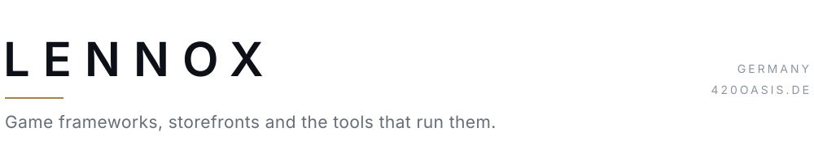
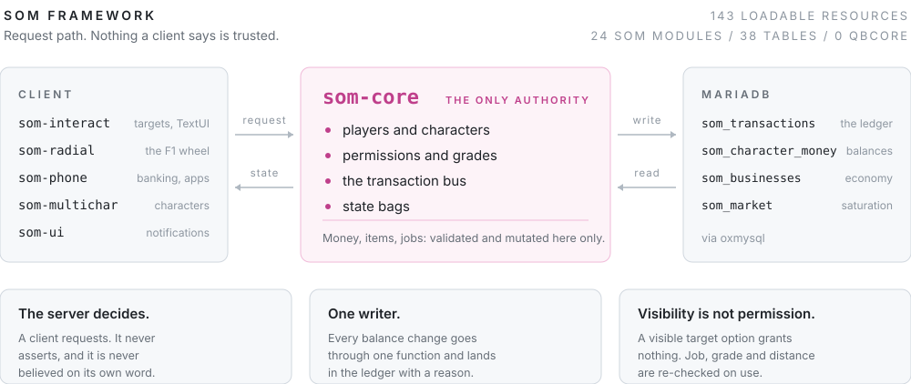

<picture>
  <source media="(prefers-color-scheme: dark)" srcset="assets/banner-dark.svg">
  
</picture>

I build systems other people depend on: a custom multiplayer framework for a
roleplay server, a live storefront, and the internal tooling that runs behind it.
Most of it is private, so what follows is the architecture rather than the source.

## State of Mind RP

A FiveM roleplay server running on **SOM**, a framework I wrote from the ground up
to replace QBCore. The rebuild cut the server from 286 loadable resources to 143
and moved every rule that matters into one place instead of thirty.

<picture>
  <source media="(prefers-color-scheme: dark)" srcset="assets/som-architecture-dark.svg">
  
</picture>

### Inside the framework

| Module | Role |
| --- | --- |
| `som-core` | Players, characters, money, permissions, entitlements, state bags. Everything else depends on it. |
| `som-economy` | Business register, market saturation, fines, treasury. |
| `som-phone` | The phone. Banking over the ledger, an app registry, notifications. |
| `som-police` | Two axis rank and clearance, custody, impound, plate lookups. |
| `som-garage` | Vehicle ownership, storage and retrieval. |
| `som-interact` | Wraps the target system behind one stable API, plus the single TextUI. |
| `som-radial` | The F1 wheel. Contextual actions contributed by other modules. |
| `som-multichar` | Character selection, creation and spawn. |
| `som-compat` | A fake `qb-core` export surface so preserved third party resources run untouched. |
| `som-chat` | A command line, not a chat. Hidden unless you are typing. |

Ten of twenty four. The rest cover medical, dispatch, HUD, identity documents,
appearance, inventory, props, rentals, traffic and the pause menu. Roughly 25,000
lines of Lua across 134 files, plus the NUIs.

### Decisions I would defend

**Money is not an inventory item.** It lives in `som_character_money` and moves
only through the transaction bus, which writes a row to `som_transactions` tagged
with the resource that asked and the reason it gave. One writer means the ledger
is the truth, not a reconstruction.

**Config ships with the code.** `server.cfg` is gitignored, so while boot order and
permissions lived there, every change was local and had to be copied by hand.
Config drifted between machines and produced bugs that looked like code bugs. It
now lives in a tracked `som.cfg`, and the only file anyone copies by hand is the
one holding their keys.

**One schema import.** `setup.sql` is the only migration and every statement is
guarded, so it is safe to run over a live database. Per resource `sql` folders
drift, and the copy you import is never the copy you edited.

**Patched dependencies are documented, not remembered.** Every edit to a third
party resource is listed with the reason, because an upgrade silently overwrites
all of them and that is the first place to look when something breaks.

### Where it stands

Rebuild in progress, not open to the public yet. Audit, teardown, framework core
and the inventory bridge are done. Current work is the economy layer, phone
banking on top of the ledger, and the job framework. The build spec lives in the
repository and is the source of truth for what exists and what comes next.

## Also building

**420 Oasis** &nbsp;·&nbsp; [420oasis.de](https://420oasis.de)

A premium accessories storefront for the German market. Custom Shopify theme with
single page product discovery, a custom age gate, a GSAP scroll and motion layer
with a complete reduced motion path, and structured data handled in the theme
rather than bolted on with an app. Add to cart runs on its own script with no
dependency on the motion stack, so commerce still works if the animation layer
fails.

`Liquid` `JavaScript` `GSAP` `Shopify`

**420 Oasis Business Suite** &nbsp;·&nbsp; internal

The operations side of the same store. JWT auth and accounts, support tickets
wired to email routing, finance with generated invoice PDFs, time tracking,
calendar, inventory, Shopify sync and scheduled jobs. Runs inside the free
Cloudflare tier and installs on a phone as a PWA.

`Cloudflare Workers` `KV` `Vanilla JS` `Service Workers`

## Open source

**[Aippy Multiplayer](https://github.com/LennoxIWNL/Aippy-Multiplayer)**

A backend template and full guide for adding persistent multiplayer to games built
on [Aippy](https://aippy.ai). One Cloudflare Worker in front of a key value store,
anonymous player IDs, polling instead of held connections. Built and proven in
production on Pocket Pack Opener, then written up so other creators can drop it
into their own games.

**[Twitch Channel Points Miner](https://github.com/LennoxIWNL/LennoxTwitchMiner)**

Desktop app that watches several Twitch streams at once, claims bonuses, keeps
watch streaks alive, and reports what it earned through Discord notifications and
an analytics view.

## Stack

**Languages** &nbsp; Lua, JavaScript, TypeScript, Python, SQL, Liquid

**Frontend** &nbsp; Vanilla JS, GSAP, NUI, PWA and service workers

**Backend** &nbsp; Cloudflare Workers and KV, Node, MariaDB, MySQL

**Platforms** &nbsp; FiveM, Shopify, Twitch API, Discord

## Contact

[420oasis.de](https://420oasis.de) &nbsp;·&nbsp; [@420oasis.de](https://instagram.com/420oasis.de) &nbsp;·&nbsp; support@420oasis.de
